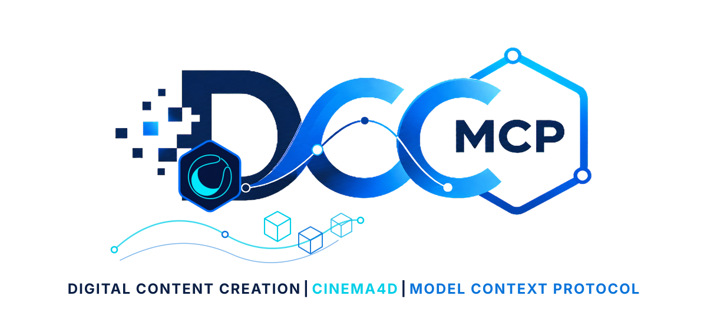

# dcc-mcp-cinema4d

<p align="center">
  
</p>

Typed Cinema 4D document automation for DCC-MCP, executed through Maxon's licensed
headless `c4dpy` runtime.

## Capabilities

- Discover and report the real Cinema 4D, Python, and API versions.
- Create, inspect, validate, and atomically copy `.c4d` documents.
- Add typed cube, sphere, cylinder, cone, torus, and plane primitives.
- Set absolute translation, HPB rotation, and scale; remove named objects safely.
- Import C4D, OBJ, FBX, glTF/GLB, STL, Alembic, Collada, and 3DS geometry when
  the installed Cinema 4D runtime provides the corresponding importer.
- Export full documents to C4D, OBJ, FBX, glTF/GLB, STL, Alembic, or Collada
  when the installed runtime provides the corresponding exporter.
- Render bounded PNG and JPEG images without a GUI.

The adapter never accepts arbitrary Python source. Every host call executes a packaged,
allowlisted driver in a fresh `c4dpy` process with bounded paths, timeouts, output streams,
and response size. Document mutations use a staged file and atomically replace the durable
document only after a successful host operation.

OBJ import and export form the production-validated interchange baseline. Other formats
are runtime-dependent; `get_capabilities` reports this boundary and unavailable optional
importers or exporters fail with a format-specific error.

## Requirements

- Cinema 4D R21 or newer with a valid license.
- The matching `c4dpy` executable shipped with that Cinema 4D installation.
- Python 3.9 or newer for the DCC-MCP service.

Maxon documents that `c4dpy` is a headless Cinema 4D instance capable of loading,
constructing, saving, and rendering scenes, but it requires a real Cinema 4D installation
and license.

## Install

```bash
python -m pip install dcc-mcp-cinema4d
```

Set the licensed runtime and allowed workspace before starting the adapter:

```powershell
$env:DCC_MCP_CINEMA4D_C4DPY = "C:\Program Files\Maxon Cinema 4D 2026\c4dpy.exe"
$env:DCC_MCP_CINEMA4D_ALLOWED_ROOTS = "D:\projects;D:\exports"
dcc-mcp-cinema4d
```

`c4dpy` is also discovered from `PATH` and common Maxon installation folders. The default
allowed root is the adapter's current working directory.

## Agent workflow

```bash
dcc-mcp-cli list
dcc-mcp-cli search Cinema 4D status --dcc-type cinema4d
dcc-mcp-cli load-skill cinema4d-session --dcc-type cinema4d --instance-id <id>
dcc-mcp-cli describe cinema4d.<id>.get_status
dcc-mcp-cli call cinema4d.<id>.get_status --json '{}'
```

Load `cinema4d-modeling` only when modeling, interchange, or rendering tools are needed.
Use `--wait` for document operations because they run as bounded asynchronous jobs.

## Development

```bash
python -m pip install -e ".[dev]"
python -m ruff check src tests
python -m ruff format --check src tests
python -m pytest -m "not cinema4d"
python -m build
python -m twine check dist/*
```

Real-host acceptance requires a licensed `c4dpy`; CI intentionally does not mock a Maxon
license.

Official references: [c4dpy manual](https://developers.maxon.net/docs/py/2025_1_0/manuals/manual_py_c4dpy.html),
[Cinema 4D Python SDK](https://developers.maxon.net/docs/py/index.html).
